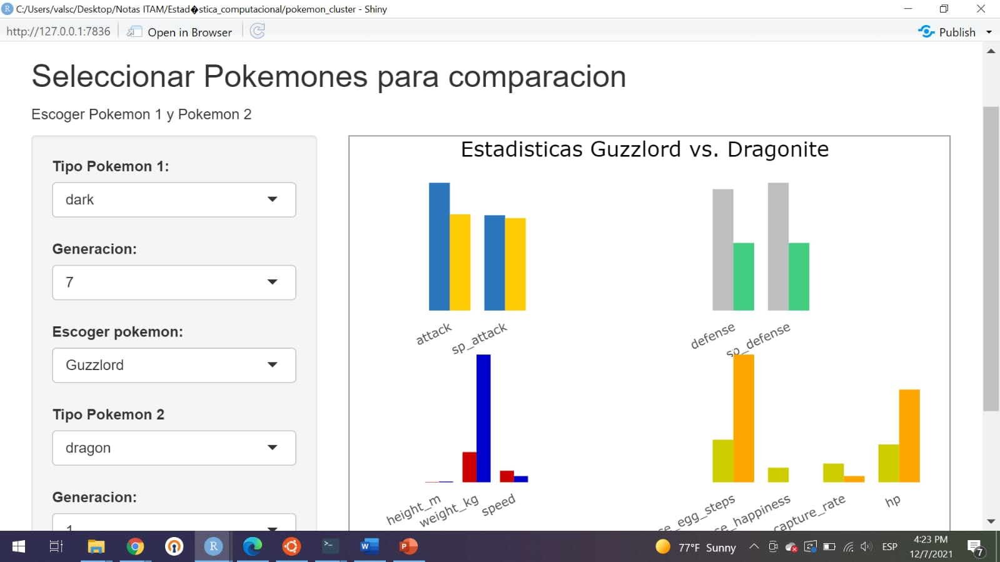
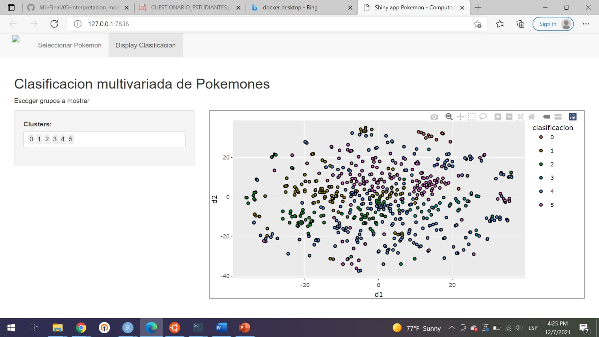

# Pokemon cluster - Proyecto final de estadística computacional 2021


## Link del repo del proyecto
[Repo del proyecto](https://github.com/jesusmb230795/pokemon_cluster)

### Colaboradores
| Nombre | Usuario |
|:---:|:---:|
|Enrique Miranda |@jesusmb230795|
|Uriel Martinez |@urielmtzsa|
|Valeria |@vserranoc|
|Yedam Fortiz |@yefovar|

## Proyecto
### Herramientas utilizadas: 
- Bash
- PostgreSQL
- Docker
- Flask
- Python
- R 
- Shiny

### Base de datos

**Número de registros:** 800 pokemones

**Número de columnas:** 41

**Variables:**
- name: Nombre del pokemon
- japanese_name: Nombre original en japones del pokemon
- pokedex_number: Número pokedex
- percentage_male: Porcentage de especies que son machos
- type1: Tipo de pokemon 1 
- type2: Tipo de pokemon 2
- classification: Clasificación del pokemon
- height_m: Altura en metros
- weight_kg: Peso en kilogramos
- capture_rate: Tasa de captura
- baseeggsteps: Número de pasos
- abilities: Lista de habilidades del pokemon
- experience_growth: Experiencia del pokemon
- base_happiness: Felicidad
- against_?: 8 variables que denotan el monto del daño
- hp: HP
- attack: Ataque base
- defense: Defensa base
- sp_attack: Ataque especial
- sp_defense: Defensa especial
- speed: Velocidad
- generation: Generación
- is_legendary: Denota si el pokemon es legendario 

### Pregunta Analítica
¿Cómo ser un maestro pokemon?

### Pasos para correr este proyecto: 

- Clonar el repositorio 
```bash
git clone git@github.com:jesusmb230795/pokemon_cluster.git
```

- Cambiar al directorio del proyecto
```bash
cd pokemon_cluster 
```

- Construir las imagenes
```bash
docker-compose build
```

- Activa los contenedores
```bash
docker-compose up
```

### EDA y modelado
Para más detalles del modelado se puede consultar el notebook, donde se realizó todo ese proceso.
[notebook](https://github.com/jesusmb230795/pokemon_cluster/blob/main/notebooks/pokemon.ipynb)

### Docker compose
- Postgre: Imagen con todo lo necesario para la base de datos.
- urielmtzsa/pokemon_app: Imagen de python con todos los requerimientos de la app.

### Base de datos
Cuando termine de correr el docker-compose, la base de datos estará encendida en el puerto 5432, de manera local. Un ejemplo de como realizar consultas a la base de datos desde python:
```python
import psycopg2
connection = psycopg2.connect(user="postgres",
  password="pokemon",
  host="0.0.0.0",
  port="5432")
cursor = connection.cursor()
cur = connection.cursor(cursor_factory=psycopg2.extras.NamedTupleCursor)
cur.execute("SELECT * FROM pokemon_;")
results = cur.fetchall()
cur.close()
results = json.dumps([x._asdict() for x in results], default=str)
pokemon = pd.read_json(results)
pokemon.head()
```

### API con Flask
Una vez inicializados los contenedores se pueden hacer llamadas a la aplicación desde el navegador, como los siguientes ejemplos
- Calibrar modelo y selección del número de clusters:
  - http://localhost:8080/modelo?numeroclusters=6&calibracion=True
- Clases de los datos históricos:
  - http://localhost:8080/modelo?numeroclusters=7&calibracion=False


Se programaron dos scripts en bash con diferentes objetivos: 
- Añadir valores a la base de datos:
```bash
sh addvalues.sh
```
Dentro del script addvalues.sh viene lo siguiente:
```bash
curl -X POST -H "Content-Type: application/json"\
     -d '[{"Abilities":"Volt Absorb  Quick Feet","Against_Bug":1,"Against_Dark":1,"Against_Dragon":1$
     {"Abilities":"Volt Absorb  Quick Feet","Against_Bug":1,"Against_Dark":1,"Against_Dragon":1,"Aga$
     0.0.0.0:8080/pokemons
```
Además, se debe de volver a calibrar el modelo, con la siguiente llamada a la aplicación:
- http://localhost:8080/modelo?numeroclusters=6&calibracion=True

- Realizar predicción de un pokemon:
```bash
sh addpredictions.sh
```
Dentro del script addpredictions.sh viene lo siguiente:
```bash
curl -X POST -H "Content-Type: application/json"\
     -d '[{"Abilities":"Volt Absorb  Quick Feet","Against_Bug":1,"Against_Dark":1,"Against_Dragon":1$
     {"Abilities":"Volt Absorb  Quick Feet","Against_Bug":1,"Against_Dark":1,"Against_Dragon":1,"Aga$
     0.0.0.0:8080/predictions
```

### Dashboard
Comparación de pokemones:

Visualización de cluster's con con reducción de dimensionalidad (t-sne)


## Descripción del pipeline completo:
- Preprocesamiento de datos a través de cli
- Base de datos
- Modelado
  - t-sne
  - KMeans
- Dashboard

### Referencias:
- https://github.com/Skalas/Estadistica-Computacional-fall2021/tree/main/materials
- https://www.kaggle.com/rounakbanik/pokemon
- https://scikit-learn.org
- https://flask.palletsprojects.com/en/2.0.x/
- https://shiny.rstudio.com
- https://www.docker.com

